# Practice Note Book
## [2026-01-09]
### Items number : 3
### 1.Add Collaborators & change account
  - Add Collaborators
    1. Open Repositories -> open Project -> collaborators -> setting
    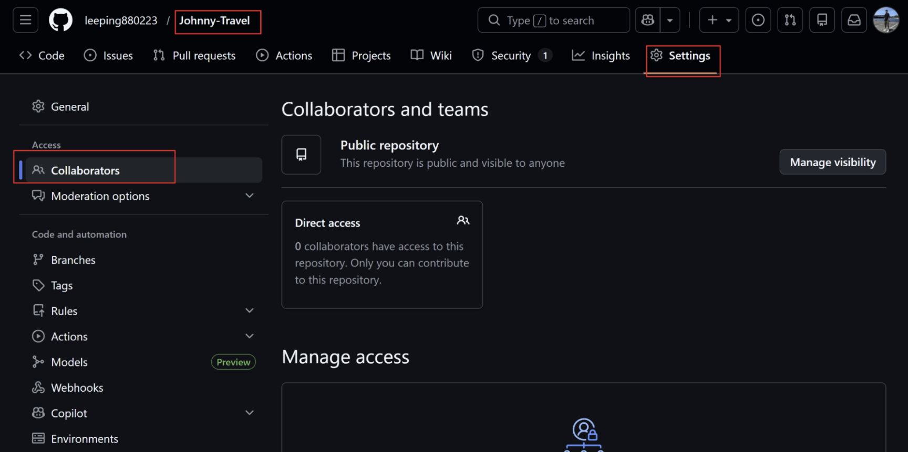
    2. 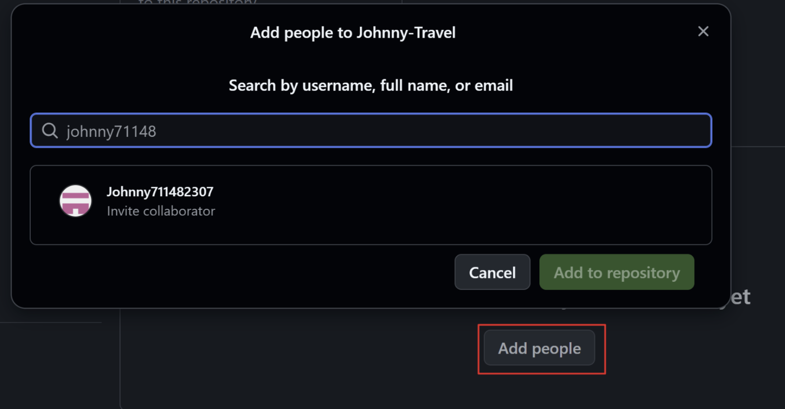
  - change account
    1. Clear_GitHub_Account
    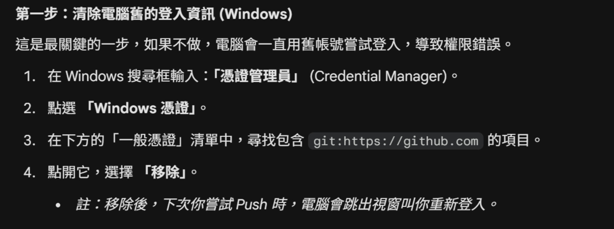
    2. Change_GitHub_UserName_email_in_PC
    **Key :  change the email(auto connet to account)** 
    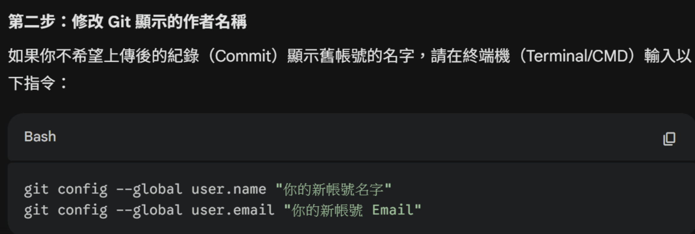
    4. push code
    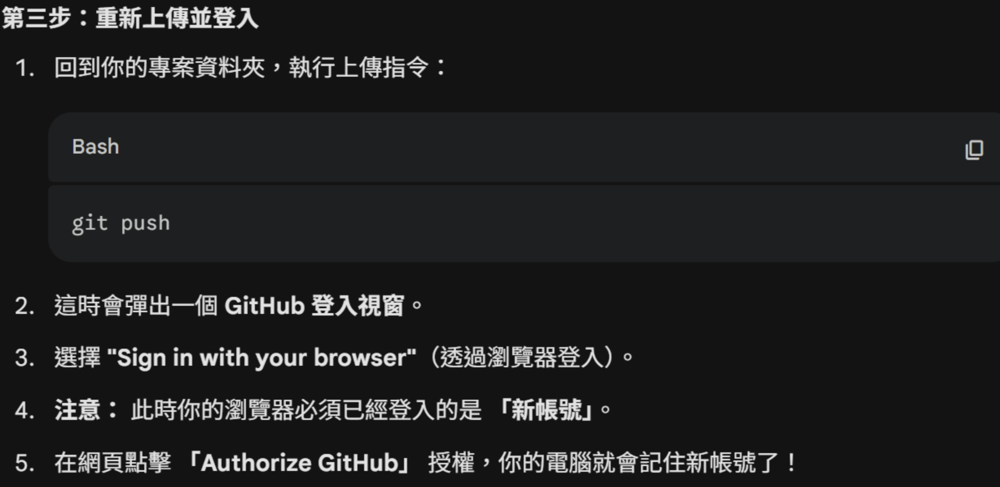
### 2.How to make a Folder Structure
  1. Get the "tree" then copy 
        ```bash
        tree /f
        ```
        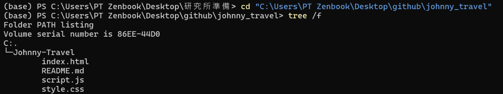

  2. Past and Preview
        past and using `crt + k` + `v` to preview
        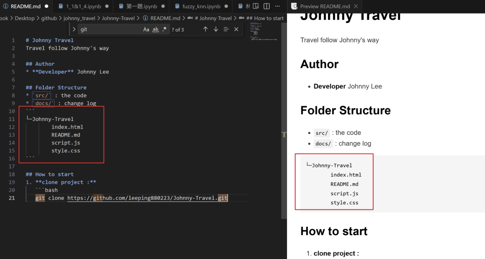
### 3.How to clone & pull & push code
  * **Clone (First time)**
    Create a new folder and "cd" to there
    ```bash
        cd ".\Newfloder"
    ```
    Clone the file
    ```bash
        git clone <code link>
    ```
    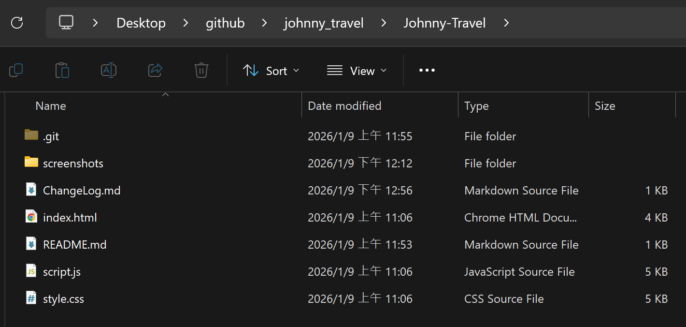 
 * **Pull(maintain)**
    - **Fetch**
     Use "fetch" "check" is it any change from the github before "Pull". 
     **origin** mean cloud(the cold is already in GitHub)
        ```bash
         git fetch
         git status 
         git diff origin/main <file name>
        ```
        
    - **Pull**
    This function "compares" the code between the PC and GitHub. If the different in other document it will "atuo change".(If your fried edit other file it will auto using your fried's code)
        ```bash
            git pull
            git status
        ```
        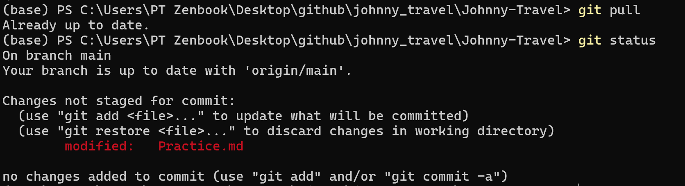
    - **Restore & Reset**
    1. Unstage a file (red to green) If you added a file to the Staging Area by mistake, use this to move it back to the Modified list **without losing your code**.  
    **Note**: This changes the status from green (staged) back to red (unstaged).
        ```bash
            git restore --staged <file name>
        ```
     2. Discard local changes (remove edit) If you messed up your code and want to completely delete your red-text changes to **match the last commit**.
        **Warning**: This will permanently delete your uncommitted changes.
        ```bash
            git restore <file name>
        ```
    3. Hard Reset (restore all) Discard all local changes in every file to perfectly match the GitHub branch.
        ```bash
            git reset --hard origin/<branch name>
        ```
 * **Push(maintain)**
   1. Using **"git status"** & **"git diff"** check that is there any change when you are coding.
   2. Using **"git add ."** to upload all of the file to Staging Area.
   3. **git commit -m "<what you change>"** it will show in the commit title
   4. **git push -u <branch name>** upload all of the file to GitHub.
   5. **git log --oneline** get the commit list
    ```bash
        git status
        git diff
        git add .
        git commit -m "<what you change>"
        git push -u origin <branch name>
        git log --oneline
    ```
    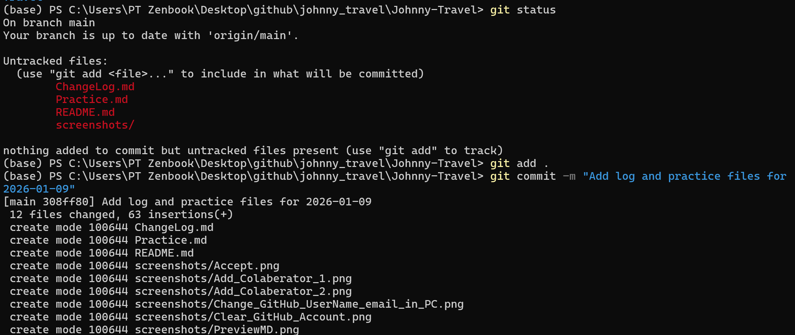
    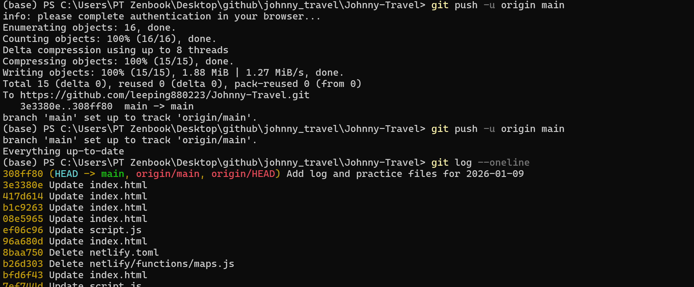
* **branch**
    1. Create & Switch a new branch
    ```bash
    git checkout -b <branch name>
    ```
    2. Push Branch to GitHub
    ```bash
    git push -u origin <branch_name>
    ```
    3. Merge
    **"git checkout main"** swich branch
    **"git pull"** chech that is new
    **"git merge <branch_name>"** merge
    **"git push"** update
    ```bash
    git checkout main
    git pull
    git merge <branch_name>
    git push
    ```
    4. Delete Branch
    ```batch
    git branch -d <branch_name>
    ```